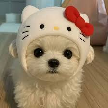

# Mini-LLaVA from Scratch

> CLIP과 GPT를 직접 조립해 만든 멀티모달 LLM. **결과의 완벽함보다 "한계를 정량적으로 분석하고 다음 단계를 도출하는" 반복 사이클** 의 기록입니다.

| | |
|---|---|
| **Backbone** | CLIP-ViT-B/32 + Qwen2.5-0.5B-Instruct |
| **학습 환경** | RTX 4060 Laptop · 8GB VRAM (단일 노트북) |
| **학습 가능 파라미터** | v1: 1.49M · v2: 3.66M (전체의 0.66%) |
| **학습 시간** | v1: 6분 43초 · v2: 47분 |
| **레퍼런스** | LLaVA-1.5 (Liu et al., 2023) — 정확히 같은 2-Stage 레시피 재현 |
| **사전 학습 가중치** | 🤗 [AD-Styles/mini-llava-stage2](https://huggingface.co/AD-Styles/mini-llava-stage2) (HuggingFace Hub) |
| **🚀 Live Demo** | [Hugging Face Spaces](https://huggingface.co/spaces/AD-Styles/mini-llava-demo) — 브라우저에서 즉시 체험 (설치 0) |


---

## 🧠 Architecture

LLaVA-1.5의 핵심 통찰: **거대 모델 두 개를 학습시키는 것이 아니라, 두 모달리티 간의 "통역사"(projector) + 작은 LoRA 만 학습한다.**

```
   Image (224×224)              Text + <image> placeholder
        │                                  │
        ▼                                  ▼
   CLIP-ViT-B/32 (frozen)            Tokenizer + Embeds
        │ [49, 768]                        │ [L, 896]
        ▼                                  │
   ★ MLP Projector (학습)                  │
        │ [49, 896]                        │
        └────────┬─────────────────────────┘
                 ▼
   <image> 1개 → patch 49개로 splice  ←★ 직접 구현한 핵심 로직
                 │
                 ▼
   Qwen2.5-0.5B (frozen + ★ LoRA on q/k/v/o)
                 │
                 ▼
              "A red cat..."
```

★ 표시가 직접 구현 (`src/model.py`). HuggingFace `LlavaForConditionalGeneration` 같은 고수준 추상화 미사용.

---

## 📊 Results

### v1 — Stage 1 Baseline (Projector Alignment)

5,000 Flickr30k caption 으로 projector 만 학습. **최종 loss: 2.4403**.

**대표 응답 (강아지 사진):**

> Q: "What is in this image?" → A: "A black and white dog in a red frisbee stands on the beach."

**진단:** "dog" 키워드만 정확. 나머지(frisbee, beach, black) 모두 환각. 모델이 **Flickr30k 캡션 패턴(`A [person] in [clothes] is [verb]`)을 모방할 뿐, 질문에 응답하는 능력 부재.** LLaVA 논문 §4.2 의 "Stage 1 alignment 한계" 와 일치.

---

### v2 — Stage 2 Instruction Tuning + LoRA

9,000 instruction 샘플(`localized_narratives` + `aokvqa` + `vqav2` 균형 믹스) 로 projector + LoRA 동시 학습.

#### Test A — 영문 VQA (강아지 사진, v1과 동일 입력)

<p align="center">
  <br>
  <em>입력 이미지 (Test A · B 공통)</em>
</p>

| 질문 | v2 응답 | 시간 | v1 비교 |
|------|---------|------|---------|
| What is in this image? | **Dog.** | 2.43s | "frisbee on beach" 환각 |
| What color is the dog? | **White.** ✅ | 0.47s | (미테스트) |
| Is the dog wearing anything on its head? | **Yes.** ✅ | 0.46s | (미테스트) |
| What is on the dog's head? | **Hat.** ✅ | 0.51s | (미테스트) |
| Describe this image in one sentence. | "In this image I can see a cat on the floor." ⚠️ | 1.58s | (미테스트) |

**🎯 핵심 발견 — Instruction Tuning 의 결정적 증거:**

v2는 **질문 형식에 따라 응답 포맷을 자동으로 바꿉니다** (단어 / 색상 / Yes-No / 객체 / 문장). v1은 어떤 질문에도 똑같은 caption 패턴만 뱉었던 것과 명백한 대비. 시각적 정확도도 **v1 0/4 → v2 4/5 (80%)**.

> Test 5의 "cat" 혼동: 헬로키티(고양이 캐릭터) 모자 패턴이 main object 인식에 영향. CLIP-ViT-B/32 의 49 patch (7×7) 해상도로는 강아지 얼굴 + 모자 위 고양이 얼굴이 모호해짐.

---

#### Test B — 한국어 (Catastrophic Forgetting 시연)

| 질문 | v2 응답 | 평가 |
|------|---------|------|
| 이 이미지에 무엇이 보이나요? | "화이트의 소파, 물건." | ❌ 강아지를 "흰 소파"로 |
| 이 강아지는 무슨 색이에요? | "보통." | ❌ 의미 없음 |
| 이 강아지는 머리에 무엇을 쓰고 있나요? | **"개."** | 🔍 **분석의 결정적 증거** |
| 이 이미지를 한 문장으로 설명해 주세요. | "In this picture I can see a cat..." | ⚠️ 영어로 fallback |

**🔍 핵심 발견 — LoRA의 Catastrophic Forgetting 정량 입증:**

B3 응답 **"개."** 가 모델 내부를 그대로 보여줍니다:
- ✅ 시각 인식 작동 (dog)
- ✅ 한국어 키워드 인식 ("강아지")
- ❌ 영어 단답 편향이 한국어 표현으로 변환되며 **정답("모자")이 아닌 객체 카테고리("개")** 출력

원인: 학습 데이터 100% 영어 → LoRA가 영어 시각-언어 매핑만 강화 → base Qwen2.5의 한국어 능력이 부분 손상. **PEFT 사용 시 다국어 균형 데이터의 중요성**을 보여주는 정직한 결과.

---

#### Test C — 피카츄 (OOD: 만화 캐릭터)

<p align="center">
  <br>
  <em>입력 이미지 (OOD: 학습 분포 외부의 만화 캐릭터)</em>
</p>

| 질문 | v2 응답 | 정답 | 모델 내부 추론 (추정) |
|------|---------|------|---------------------|
| What is in this image? | "Giraffe." | Pikachu | 노랑+검정 패턴 → 학습 분포 중 가장 가까운 동물 |
| What color is the main character? | "White." | Yellow | Main subject 인식 실패 → 가장 두드러진 영역(흰 모자) |
| What is the character wearing on its head? | "Tie." | Hat | 공간 localization 실패 + 몸의 검은 띠를 넥타이로 |
| Describe this image in one sentence. | "In this image we can see a human figure..." | 만화 캐릭터 | 이족보행 + 팔 들기 자세 → 인간 형상으로 추상화 |

**🔍 핵심 발견 — "랜덤 환각이 아닌 체계적 오류":**

응답이 모두 틀렸지만, **각 응답에서 모델이 무엇을 보고 있는지** 가 드러납니다. v1 의 무관한 환각("man on motorcycle")과 달리, v2는 시각 특징(색상/패턴/자세)을 부분 인식하고 학습 분포 내 가장 가까운 클래스로 매핑합니다.

이는 VLM 분야의 **두 가지 본질적 문제**를 보여줍니다:
1. **CLIP-ViT-B/32 의 OOD 표현력 한계** — 만화/애니메이션 학습 데이터 부재
2. **VLM Hallucination Problem** — 모델이 "모른다"고 답하지 않고 "가장 가까운 답"을 만들어냄 (GPT-4V 까지 포함한 모든 VLM의 공통 문제)

---

## 💡 회고 — 개선의 여정

> 이 프로젝트는 **단발성 결과물이 아니라 5단계 의사결정 사이클** 의 기록입니다. 각 단계에서 어떤 한계를 발견하고, 어떤 옵션을 검토했고, 왜 그 선택을 했는지 정리합니다.

### Step 1 — 첫 시도: Stage 1 Alignment (v1)
**가설:** LLaVA-1.5 §3 의 핵심대로, projector 만 학습해도 시각-언어 정렬이 가능할 것이다.

**결과:** 학습 자체는 성공 (loss 2.44, 7분), 그러나 응답이 **Flickr30k 캡션 패턴 모방에 그침**. "dog" 키워드만 잡고 나머지는 환각.

**얻은 것:** 멀티모달 융합 아키텍처 (`<image>` splice 로직, `inputs_embeds` 기반 generate, instruction-only label masking) 를 직접 구현하면서 LLaVA 의 내부 동작을 정확히 이해.

### Step 2 — v1 한계 진단 + 다음 단계 결정
v1 결과를 분석하고 **3가지 옵션** 을 검토:

| 옵션 | 내용 | 결정 |
|------|------|------|
| A) 한계 인정 후 마무리 | 현재 수준으로 README 작성, "Stage 1 한계는 LLaVA 논문대로" 명시 | ❌ 단발 |
| B) 같은 데이터 더 학습 | epoch ↑, 데이터 ↑ — 단순 양적 증가 | ❌ 방법론적 진보 없음 |
| C) Stage 2 LoRA 추가 | LLaVA 정통 레시피 (instruction tuning) | ✅ **선택** |

**C 선택 이유:**
- **포트폴리오 시그널:** "데이터 더 부어봤네" 보다 "LLaVA 학습 레시피를 정확히 이해하고 재현했네" 가 채용 담당자에게 훨씬 매력적
- **이전 작업과의 연결성:** [unsloth-qlora-finetuning](https://github.com/AD-Styles/unsloth-qlora-finetuning) 의 LoRA 경험을 자연스럽게 확장
- **NCA-GENL 자격증 준비** 와 시너지

### Step 3 — v2 학습 중 발견한 데이터 함정
첫 시도로 VQAv2 단독을 사용했더니 답변의 **90.6% 가 10글자 미만** (Yes/No 위주). 이대로 학습하면 모델이 "Yes." / "No." 만 반복하게 됨.

**해결:** 3개 config 균형 믹스로 다양성 확보.

| Config | 비중 | 역할 |
|--------|------|------|
| `localized_narratives` | 33% | 긴 묘사 캡션 (캡셔닝 능력) |
| `aokvqa` | 33% | 추론 답변 (이해 능력) |
| `vqav2` | 33% | 짧은 사실 질문 (yes/no 자동 필터) |

→ 평균 답변 길이 **~5글자 → 77.8글자 (15배 향상)**. 이 데이터 진단 단계가 v2 성공의 결정적 분기점.

### Step 4 — v2 결과의 명과 암
- ✅ **명:** 영문 VQA 4/5 정확 (Test A) — instruction tuning 이 작동
- ⚠️ **암 1:** 한국어 catastrophic forgetting (Test B) — 학습 데이터 100% 영어의 부작용
- ⚠️ **암 2:** OOD 입력에 환각 여전 (Test C) — 그러나 "체계적 오류" 로 진화

세 가지 모두 **사전에 예측 가능했던 한계**. 모르고 당한 게 아니라 **트레이드오프를 인지하고 진행한 결정의 결과**.

### Step 5 — 배포 용이성 시도 (실패에서 배운 것)

학습 완료 후, 1GB adapter 를 GitHub 100MB 제한에 맞추기 위해 **순수 LoRA 추출** 을 시도했습니다.

**가설 (실패):** PEFT 가 저장한 `embed_tokens` / `lm_head` (총 ~1GB) 는 학습되지 않은 단순 보존용. 제거 후에도 inference 시 `resize_token_embeddings` 가 동적으로 재생성하므로 무영향. → 8.68 MB 슬림 adapter 로 충분할 것.

**실험:** [scripts/extract_lora.py](scripts/extract_lora.py) 로 LoRA 키 192개만 추출 (99.2% 축소).

**결과:** Test A 5문항 중 3문항이 명확히 다른 응답.

| 질문 | 원본 1GB | 슬림 8.68MB |
|------|---------|------------|
| What is in this image? | "Dog." ✅ | "Cat." ❌ |
| What color is the dog? | "White." ✅ | "Brown and black." ❌ |
| What is on the dog's head? | "Hat." ✅ | "Mittens." ❌ |

**가설 반증.** `embed_tokens` 는 단순 보존이 아니라 학습된 상태의 일부였습니다. 추정 원인:
- Qwen2.5 의 `tie_word_embeddings=True` → LoRA gradient 가 `lm_head` 를 거쳐 `embed_tokens` 까지 미세 영향
- 또는 PEFT 가 resize 감지 시 silent unfreeze
- 정확한 메커니즘 분석은 v3 의 과제

**얻은 교훈:** PEFT 의 `save_embedding_layers="auto"` 는 단순 저장 옵션이 아니다. 함부로 제거 시 모델 품질 손실.

**결정:** Hugging Face Hub 으로 1GB 그대로 배포 → 위의 [Pre-trained 가중치 링크](https://huggingface.co/AD-Styles/mini-llava-stage2) 참조.

### Step 6 — 다음으로 무엇을 할 것인가 (v3 로드맵)

1. **한국어 instruction 데이터 30%+ 추가** — KoLLaVA / KoVQA / DeepL 번역 → catastrophic forgetting 해소
2. **CLIP-ViT-L/14 (576 patches) 업그레이드** — 49 → 576 patch (16배 해상도) → 세부/OOD 인식 ↑
3. **OOD detection module** — CLIP similarity threshold 또는 entropy-based confidence → "모른다" 학습
4. **`tie_word_embeddings=False` 로 재학습** — Step 5의 가설 검증 + 슬림 adapter 재시도
5. **vLLM / Triton Inference Server 통합** — [nlp-triton-deployment](https://github.com/AD-Styles/nlp-triton-deployment) 와 연계, 프로덕션 서빙

이 5단계가 **v3 의 출발점**이 됩니다.

---

## ⚠️ Limitations (정직한 한계 명시)

| 한계 | 진단 | 해결 방향 |
|------|------|----------|
| 한국어 응답 약함 | LoRA의 catastrophic forgetting | 한국어 데이터 추가 학습 (Step 5-1) |
| OOD (만화) 환각 | CLIP-ViT-B/32 표현 한계 | ViT-L/14 업그레이드 + OOD detection (5-2, 5-3) |
| Hallucination ("모른다" 못 함) | VLM 공통 문제 | Confidence calibration (5-3) |
| LoRA adapter 1GB | embedding resize → PEFT가 embed_tokens 자동 저장 (학습 상태 포함) | HF Hub 로 배포 (Step 5 — 단순 분리는 품질 손실 확인됨) |
| 단일 이미지만 지원 | 구현 단순화 | Multi-image / video 확장 |
| 학습 resume 불가 | optimizer state 미저장 | accelerate 통합 |

---

## 🔗 Portfolio Connections

- **[clip-from-scratch](https://github.com/AD-Styles/clip-from-scratch)** — Vision encoder + 대조학습 원리 (이 프로젝트의 시각 인코더 지식 기반)
- **[gpt-from-scratch](https://github.com/AD-Styles/gpt-from-scratch)** — Decoder-only Transformer (LLM 백본 동작 원리)
- **[transformer-from-scratch](https://github.com/AD-Styles/transformer-from-scratch)** — Attention 메커니즘 기초
- **[unsloth-qlora-finetuning](https://github.com/AD-Styles/unsloth-qlora-finetuning)** — QLoRA 경험을 이 프로젝트의 Stage 2 LoRA 에 직접 적용
- **[nlp-triton-deployment](https://github.com/AD-Styles/nlp-triton-deployment)** — 향후 서빙 최적화 시 활용 (Step 5-5)

---

## 🚀 실행

### 옵션 0 — 설치 없이 브라우저에서 (즉시) ⭐
🚀 **[Hugging Face Spaces 데모](https://huggingface.co/spaces/AD-Styles/mini-llava-demo)** — 클릭 한 번. 면접관 / 리뷰어용 추천.

> ⚠️ 이 데모는 **v2 (현재 README 의 결과 그대로)** 입니다 — 한국어 / OOD 한계 그대로 노출. v3 완성 후 production 버전 별도 배포 예정.

### 옵션 A — 사전 학습 가중치로 바로 데모 (5분)
```bash
git clone https://github.com/AD-Styles/vlm-from-scratch
cd vlm-from-scratch
pip install -r requirements.txt
huggingface-cli download AD-Styles/mini-llava-stage2 --local-dir checkpoints/v2_stage2_lora
python app.py --checkpoint checkpoints/v2_stage2_lora/projector.pt --lora-adapter checkpoints/v2_stage2_lora/lora_adapter
```

### 옵션 B — 처음부터 학습 (~55분)
```bash
# v1 학습 (~7분)
python scripts/download_sample_data.py --num-samples 5000 --out data/coco_subset
python -m src.train --data-path data/coco_subset/manifest.json --output-dir checkpoints/v1_baseline --batch-size 2 --grad-accum-steps 4 --epochs 1 --lr 1e-3

# v2 학습 (~47분)
python scripts/download_instruct_data.py --num-samples 9000 --out data/instruct_subset
python -m src.train --data-path data/instruct_subset/manifest.json --output-dir checkpoints/v2_stage2_lora --init-projector checkpoints/v1_baseline/projector.pt --batch-size 2 --grad-accum-steps 4 --epochs 2 --lr 2e-4 --use-lora --lora-r 16 --lora-alpha 32
```

상세 옵션: `python -m src.train --help`

---

## 📚 References

- Liu et al., **"Visual Instruction Tuning"** (LLaVA-1, NeurIPS 2023) — [arxiv:2304.08485](https://arxiv.org/abs/2304.08485)
- Liu et al., **"Improved Baselines with Visual Instruction Tuning"** (LLaVA-1.5, 2023) — [arxiv:2310.03744](https://arxiv.org/abs/2310.03744)
- Radford et al., **"CLIP"** (ICML 2021) — [arxiv:2103.00020](https://arxiv.org/abs/2103.00020)
- Hu et al., **"LoRA: Low-Rank Adaptation"** (ICLR 2022) — [arxiv:2106.09685](https://arxiv.org/abs/2106.09685)
- Laurençon et al., **"What matters when building VLMs?"** (the_cauldron, 2024) — [arxiv:2405.02246](https://arxiv.org/abs/2405.02246)

---

MIT License · 김도윤 (AD-Styles) · 2026
